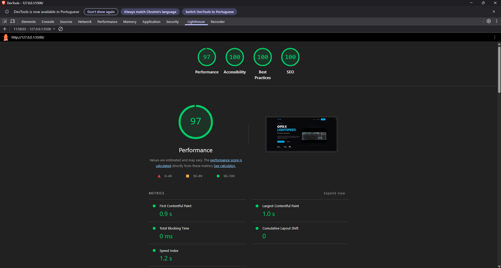
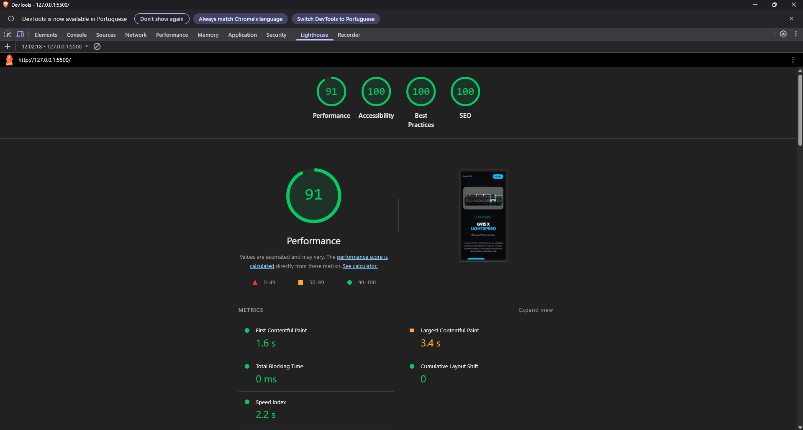

# ⌨️ G915 X LIGHTSPEED — Cinematic Landing

Landing page conceitual inspirada no teclado gamer **Logitech G915 X LIGHTSPEED**, construída com **HTML, CSS e JavaScript puros** (sem frameworks, sem bibliotecas de animação).

O projeto foi desenvolvido como um laboratório pessoal para explorar **técnicas modernas de front-end**: scroll-scrubbing de vídeo, magnetic hover, bento grid, liquid glass, reveal animations e marquee cinético. Também foi um experimento pessoal com o editor de código **Antigravity**.

## 📸 Preview

https://github.com/user-attachments/assets/f283bd89-e800-4f4f-b00b-1a6c2cfd23c9

## 🚀 Demonstração

🔗 [Acesse o site](https://rochacode08.github.io/g915x-landing/)

## 🛠️ Tecnologias utilizadas

- **HTML5** — estruturação semântica
- **CSS3** moderno com:
  - **CSS Nesting nativo** (sem Sass/Less)
  - **Custom Properties** (variáveis CSS) para theming
  - Tipografia fluida com `clamp()`
  - **Grid & Flexbox** para layouts
  - `backdrop-filter` para efeito *liquid glass*
  - `aspect-ratio`, `scroll-behavior`, `prefers-reduced-motion`
  - **Arquitetura modular** com `@import` dividindo o CSS em 15 arquivos
- **JavaScript Vanilla (ES6+)** com:
  - `IntersectionObserver` para reveals performáticos
  - `requestAnimationFrame` para animações otimizadas
  - Scroll-scrub de vídeo via `video.currentTime`
  - Física de mola (spring) manual para magnetic hover

## 🎨 Processo criativo

Todas as **animações de produto** usadas no scroll-scrub foram produzidas a partir de **imagens oficiais do G915 X** combinadas com **geração de vídeo por IA (Google Veo 3)**. A escolha dessa abordagem teve dois motivos:

1. **Fidelidade visual** — usando as imagens reais do produto como ponto de partida, os keyframes mantêm consistência com o material oficial
2. **Foco no front-end** — o tempo de desenvolvimento foi direcionado pra parte técnica (scroll-scrub, magnetic hover, performance), sem precisar virar motion designer

O fluxo foi: **imagens oficiais → keyframes gerados por IA → encadeamento manual → sincronização via JavaScript**.

## ✨ Features

| Feature | Descrição |
|---------|-----------|
| 🎥 **Scroll-Scrub Video** | Três vídeos animados sincronizados com o scroll do usuário no desktop. Em mobile, viram autoplay + loop para evitar travas de viewport. |
| 🧲 **Magnetic Hover** | Botões atraem o cursor com física de mola, simulando Framer Motion sem biblioteca. |
| 🪟 **Liquid Glass** | Cards com `backdrop-filter: blur()` + bordas translúcidas + sombras internas. |
| 🎨 **Bento Grid** | Grid assimétrico com imagens de fundo em parallax interno. |
| 🌀 **Kinetic Marquee** | Texto em movimento infinito com outline stroke. |
| 🌈 **RGB Mesh Blobs** | Blobs animados com `filter: blur()` criando um mesh gradient dinâmico. |
| 🎭 **Scroll Reveals** | Elementos aparecem com stagger delay ao entrarem na viewport. |
| 🎬 **Intro Animation** | Animação de entrada com split-panel reveal e wordmark flash. |
| ♿ **Reduced Motion** | Respeita `prefers-reduced-motion` do sistema operacional do usuário. |

## ⚡ Performance

| Métrica           | Desktop | Mobile |
| ----------------- | :-----: | :----: |
| 🚀 Performance    | **97**  | **93** |
| ♿ Accessibility   | **100** | **100**|
| ✅ Best Practices  | **100** | **100**|
| 🔍 SEO            | **100** | **100**|

<div align="center">
  
  
</div>

## 📐 Responsividade

Projeto responsivo em 4 breakpoints principais:

| Dispositivo    | Largura         | Principais ajustes                                    |
| -------------- | --------------- | ----------------------------------------------------- |
| 💻 Desktop     | acima de 1024px | Todos os efeitos ativos, incluindo scroll-scrub       |
| 📱 Tablet      | 768px – 1024px  | Layouts em coluna, vídeos em autoplay/loop            |
| 📱 Mobile      | até 768px       | Navegação simplificada, tipografia reduzida           |
| 📱 Mobile S    | até 480px       | Paddings e fontes ainda mais enxutos                  |

### ⚠️ Decisão de design sobre scroll-scrub em mobile

As seções com scroll-scrub (`scroll-sequence-wrapper`) têm altura de **400vh** no desktop para dar "espaço de scroll" ao vídeo acompanhar o movimento do usuário. Isso funciona muito bem no desktop, mas em mobile causava um bug de percepção: quando o layout virava coluna, o vídeo saía da viewport, e o usuário rolava por 4x a altura da tela em uma área aparentemente vazia — parecia que a página havia travado.

**Solução adotada:** abaixo de 1024px, o wrapper volta a ter altura natural (`height: auto`) e os vídeos são exibidos em autoplay + loop. O efeito visual é mantido, mas sem "scroll fantasma".

## 📂 Estrutura do projeto

```
📦 g915x-landing
 ┣ 📂 assets
 ┃ ┣ 🎥 4k_keyframed.mp4              → Vídeo do teclado em 4K
 ┃ ┣ 🎥 switch-v2-keyframed.mp4       → Vídeo dos switches
 ┃ ┗ 🎥 pbt-keyframed.mp4             → Vídeo das keycaps PBT
 ┣ 📂 styles
 ┃ ┣ 📜 index.css                     → Arquivo principal (importa os demais)
 ┃ ┣ 📜 global.css                    → Reset, variáveis e scrollbar
 ┃ ┣ 📜 utility.css                   → Classes utilitárias e scroll reveals
 ┃ ┣ 📜 typography.css                → Headlines e textos base
 ┃ ┣ 📜 nav.css                       → Estilos da navegação
 ┃ ┣ 📜 buttons.css                   → Botões magnéticos
 ┃ ┣ 📜 hero.css                      → Hero + scroll sequence
 ┃ ┣ 📜 bento.css                     → Bento grid
 ┃ ┣ 📜 marquee.css                   → Kinetic marquee
 ┃ ┣ 📜 zigzag.css                    → Seção zig-zag editorial
 ┃ ┣ 📜 specs.css                     → Seção de especificações
 ┃ ┣ 📜 rgb-blobs.css                 → RGB mesh blobs
 ┃ ┣ 📜 footer.css                    → Rodapé
 ┃ ┣ 📜 intro-animation.css           → Animação de entrada da página
 ┃ ┗ 📜 accessibility.css             → Reduced motion
 ┣ 📜 index.html                       → Estrutura HTML semântica
 ┗ 📜 script.js                        → Interações e animações vanilla
```

## 💻 Como rodar o projeto

Clone o repositório:

```bash
git clone https://github.com/rochacode08/g915x-landing.git
```

Acesse a pasta do projeto:

```bash
cd g915x-landing
```

Abra o arquivo `index.html` no navegador — ou utilize a extensão **Live Server** do VS Code para recarregamento automático.

> ✅ Sem build step, sem `npm install`. É HTML/CSS/JS puro rodando direto no navegador.

## 📚 O que foi trabalhado

Este projeto foi um laboratório para praticar:

### 🎬 Animações e interações
- **Sincronização de vídeo com scroll** (técnica popular em sites premium como Apple e Arc Browser)
- **Magnetic hover** com física de mola manual (sem GSAP/Framer Motion)
- **Parallax** interno nos cards do bento grid
- **Staggered reveals** com `IntersectionObserver`
- **Kinetic marquee** com outline text
- **Intro animation** com split-panel reveal

### ⚙️ Performance
- Uso de `requestAnimationFrame` em vez de listeners pesados no scroll
- Event listeners com `{ passive: true }` para não bloquear o main thread
- Detecção de `seeking` do vídeo para evitar travamentos
- Pulo de reflow com cálculos baseados em `getBoundingClientRect` apenas quando necessário

### 🎨 CSS moderno
- **CSS Nesting nativo** (suportado em todos os navegadores modernos)
- **Arquitetura modular** — CSS dividido em 15 arquivos por responsabilidade, importados via `@import` no `index.css`
- **Container queries ready** com tipografia fluida
- `backdrop-filter` para glassmorphism
- Combinação de `filter: blur()` com `mix-blend-mode` para mesh gradients

### ♿ Acessibilidade
- `prefers-reduced-motion` para usuários sensíveis a animações
- `aria-label` em botões sem texto visível
- Detecção de `(hover: hover)` para evitar comportamentos estranhos em touch
- Autoplay de vídeo com fallback silencioso se bloqueado pelo navegador

## 🔮 Melhorias futuras

- [ ] Adicionar versão em inglês com toggle de idioma
- [ ] Implementar *lazy loading* inteligente para os vídeos
- [ ] Adicionar seção de comparação com outros teclados
- [ ] Criar animações customizadas para navegadores sem suporte a `backdrop-filter`
- [ ] Adicionar testes de performance automatizados com Lighthouse CI

## 📄 Créditos e Licença

Este é um **projeto de estudo sem fins comerciais**. Todos os direitos sobre a marca **Logitech**, o produto **G915 X LIGHTSPEED**, as imagens e textos referentes pertencem à **Logitech International S.A.** e foram utilizados apenas para fins educacionais e de portfólio.

Os vídeos do produto foram gerados a partir de imagens oficiais da Logitech utilizando o modelo **Google Veo 3**, apenas para simular animações cinemáticas — sem nenhum propósito comercial.

Nenhuma afiliação ou endosso por parte da Logitech é implicado neste projeto.

---

## 👨‍💻 Autor
Desenvolvido com 💙 por **[Gabriel Rocha Lopes](https://github.com/rochacode08)**

<a href="mailto:gabrielrocha.devstack@gmail.com">
    
</a>
<a href="https://www.linkedin.com/in/gabriel-rocha-devstack">
    
</a>
<a href="https://www.instagram.com/gabriel_lopess15/">
    
</a>

---
